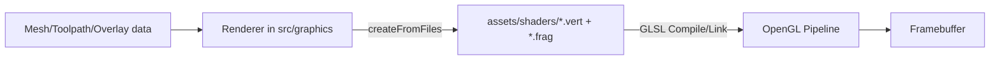

# Assets (Shader)

Shader assets for rendering the 3D scene, overlays, and toolpaths.

## 1. Purpose and Responsibility
The `assets` module provides GLSL shaders used by renderers to visualize scene geometry, coordinate axes, grids, toolpaths, and Phi overlays.
It does not implement render logic, shader compilation, or an asset pipeline; those concerns live in `src/graphics` (e.g., `ShaderProgram` and renderer classes).
Within the overall architecture, `assets` supplies runtime-loaded shader sources only.

## 2. Conceptual Overview
- **Concepts/Patterns**: Separation of data (shader sources) and logic (renderers + `ShaderProgram`). This keeps shaders swappable while render logic remains unchanged.
- **Design decision: GLSL 1.50**: All shaders use `#version 150`, matching the OpenGL 3.2 core profile and especially the macOS-compatible path (mirroring the ImGui GLSL setup in `src/ui/im_gui_layer.cpp`).
- **Design decision: fixed attributes**: Renderers assume fixed attribute locations (`aPos` -> 0, `aColor`/`aNormal` -> 1). This reduces state management and matches the bindings in `ShaderProgram`.

## 3. Directory and File Structure
```
assets/
└── shaders/
    ├── axes.vert         # Vertex shader for coordinate axes (position + color)
    ├── axes.frag         # Fragment shader for axis colors
    ├── grid.vert         # Vertex shader for ground grid (position)
    ├── grid.frag         # Fragment shader for semi-transparent grid
    ├── scene.vert        # Vertex shader for mesh rendering (position + normals)
    ├── scene.frag        # Fragment shader for simple lighting/wireframe
    ├── toolpath.vert     # Vertex shader for toolpath lines (position + color)
    ├── toolpath.frag     # Fragment shader for toolpath colors
    ├── phi_overlay.vert  # Vertex shader for Phi overlay (position + Phi value)
    └── phi_overlay.frag  # Fragment shader with Viridis color mapping
```

## 4. Main Components (Shaders)
**axes.vert / axes.frag**
- **Responsibility**: Renders colored coordinate axes as line segments.
- **Interfaces**: `aPos` (vec3), `aColor` (vec3), `uMVP` (mat4).
- **Relation**: Loaded by `AxesRenderer` (`src/graphics/axes_renderer.cpp`).

**grid.vert / grid.frag**
- **Responsibility**: Renders a semi-transparent ground grid.
- **Interfaces**: `aPos` (vec3), `uMVP` (mat4).
- **Relation**: Loaded by `GridRenderer` (`src/graphics/grid_renderer.cpp`).

**scene.vert / scene.frag**
- **Responsibility**: Renders scene geometry with simple diffuse lighting or wireframe.
- **Interfaces**: `aPos` (vec3), `aNormal` (vec3), `uMVP` (mat4), `uNormalMat` (mat3), `uWireframe` (bool), `uAlpha` (float).
- **Relation**: Loaded by `SceneRenderer` (`src/graphics/scene_renderer.cpp`).

**toolpath.vert / toolpath.frag**
- **Responsibility**: Renders toolpaths as colored lines (contour, infill, travel).
- **Interfaces**: `aPos` (vec3), `aColor` (vec3), `uMVP` (mat4).
- **Relation**: Loaded by `ToolpathRenderer` (`src/graphics/toolpath_renderer.cpp`).

**phi_overlay.vert / phi_overlay.frag**
- **Responsibility**: Visualizes the Phi value as a heatmap overlay on a mesh.
- **Interfaces**: `aPos` (vec3), `aPhi` (float), `uMVP` (mat4), `uPhiMin`/`uPhiMax` (float).
- **Relation**: Loaded by `graphics::PhiOverlayRenderer` (`src/graphics/phi_overlay_renderer.cpp`).
- **Design rationale**: The Viridis mapping is implemented as a polynomial fit to avoid a LUT texture while still providing a perceptually uniform scale.

## 5. Interfaces and Data Flow
**Inputs**
- Vertex attributes from renderers (position, normal, color data).
- Uniforms (MVP matrix, normal matrix, wireframe flag, alpha, Phi range).

**Outputs**
- Fragment colors for lines, grids, meshes, and overlays.

**Communication with Other Modules**
- Shaders are loaded at runtime via `ShaderProgram::createFromFiles()` from `src/graphics/shader_program.cpp`.
- Path resolution uses `MEDUSA_PROJECT_ROOT`.



## 6. Libraries / Dependencies
- **OpenGL / GLSL 1.50**
  - **Purpose**: Executes shaders in the core profile.
  - **Rationale**: `#version 150` matches the OpenGL 3.2 core profile and is a reliable target on macOS.
  - **License**: Provided by the system OpenGL implementation.

## 7. Build Integration
- No direct build integration via CMake in `assets/`.
- Shaders are loaded at runtime via absolute paths (`MEDUSA_PROJECT_ROOT "/assets/shaders/..."`).
- This implies the invariant that runtime execution uses a correct `MEDUSA_PROJECT_ROOT`.

## 8. Usage (for Other Developers)
Minimal flow (simplified, runnable structure depends on `ShaderProgram` API):

```cpp
ShaderProgram shader;
if (shader.createFromFiles(
        MEDUSA_PROJECT_ROOT "/assets/shaders/scene.vert",
        MEDUSA_PROJECT_ROOT "/assets/shaders/scene.frag"))
{
    shader.use();
    glUniformMatrix4fv(shader.loc("uMVP"), 1, GL_FALSE, glm::value_ptr(mvp));
    // ... bind VAO and issue draw call ...
}
```

## 9. Extension and Maintenance
- **Extension points**: Add new shader pairs in `assets/shaders/` plus a matching renderer in `src/graphics/`.
- **Invariants**:
  - Keep `#version 150` unless the target OpenGL profile changes.
  - Keep attribute names `aPos`, `aColor`, `aNormal` (bindings in `ShaderProgram`).
  - Uniform names must match renderer lookups (e.g., `uMVP`).
- **Limitations**: No hot-reload; shaders are loaded during initialization and not watched.

## 10. Glossary
- **MVP**: Model-View-Projection matrix, transforms object coordinates to clip space.
- **Phi overlay**: Heatmap rendering of a scalar field (Phi) on geometry.
- **Viridis**: Perceptually uniform colormap, implemented here as a polynomial fit.
