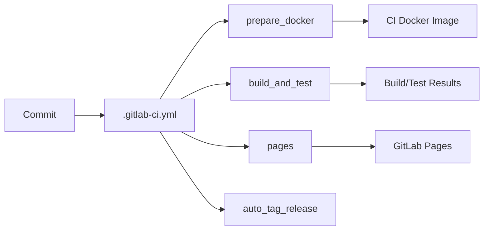

# CI

Continuous integration configuration, build tooling, and container setup.

## 1. Purpose and Responsibility
The `ci` module defines the CI pipeline, its build environment, and supporting scripts.
It does not contain application code; it orchestrates how the project is built, tested, and published.
Within the overall architecture, it standardizes reproducible builds and automated checks.

## 2. Conceptual Overview
- **Concepts/Patterns**: Pipeline stages, containerized build environments, and cached compilation artifacts.
- **Design decision: Docker-based toolchain**: CI uses a prebuilt Docker image to keep build dependencies consistent.
- **Design decision: single-pass build/test**: Compilation and tests run in a single job for faster feedback.

## 3. Directory and File Structure
```
ci/
├── README.md        # This documentation
├── cmake/
│   └── CMakeLists.txt  # Builds and installs ImGui into the CI image
└── docker/
    └── Dockerfile      # CI build image definition
```

Related root files:
- `.gitlab-ci.yml`: Pipeline definition and job configuration.

## 4. Main Components (Files)
**.gitlab-ci.yml**
- **Responsibility**: Defines stages, jobs, caching, and deployment rules.
- **Key stages**: `prepare`, `check`, `build_and_test`, `deploy`, `tag`.
- **Relation**: References `ci/docker/Dockerfile` and uses the built image.

**ci/docker/Dockerfile**
- **Responsibility**: Builds the CI image with toolchain, libraries, and helper artifacts.
- **Key actions**: Installs build tools, sets up ccache, builds gtest, precompiles GLAD, and installs ImGui via `ci/cmake`.
- **Relation**: Used by the `prepare_docker` job to build and publish the CI image.

**ci/cmake/CMakeLists.txt**
- **Responsibility**: Builds the ImGui docking branch and installs headers/libs into the CI image.
- **Relation**: Executed in the Docker build to provide ImGui without rebuilding it in each CI job.

## 5. Interfaces and Data Flow
**Inputs**
- Source tree and CMake configuration.
- CI variables (e.g., `CMAKE_BUILD_PARALLEL_LEVEL`, `CMAKE_CXX_COMPILER_LAUNCHER`).

**Outputs**
- Build artifacts, test results, and generated documentation (GitLab Pages).

**Communication with Other Modules**
- The pipeline uses the root `CMakeLists.txt` and `tests/` targets.
- Doxygen output from `docs/doxygen/` is published to Pages.



## 6. Libraries / Dependencies
- **Docker**: Containerized CI runtime environment.
- **CMake/Ninja/ccache**: Build toolchain.
- **Doxygen/Graphviz**: Documentation generation.
- **GLAD/GLFW/Assimp/ImGui**: Preinstalled dependencies for CI builds.

## 7. Build Integration
- CI uses `add_subdirectory(external)` as part of the normal project build.
- Tests are enabled via `-DMEDUSA_BUILD_TESTS=ON` in the CI job.

## 8. Usage (for Other Developers)
Local usage mirrors CI behavior but is optional for contributors. CI is defined in `.gitlab-ci.yml`.

## 9. Extension and Maintenance
- **Extension points**: Add new pipeline stages or jobs in `.gitlab-ci.yml` and update the image if dependencies change.
- **Invariants**:
  - The CI image must provide all build dependencies used by the pipeline.
  - Job rules should keep CI fast and deterministic.
- **Limitations**: The pipeline is GitLab-specific; other CI systems require separate configuration.

## 10. Glossary
- **CI**: Continuous Integration.
- **CCache**: Compiler cache for faster rebuilds.
- **GitLab Pages**: Static site hosting for documentation artifacts.

