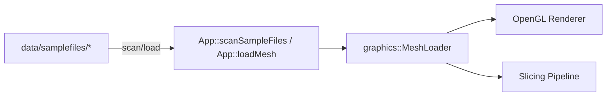

# Sample Files

Sample mesh files used for validation of the importer, OpenGL renderer, and slicer.

## 1. Purpose and Responsibility
The `data/samplefiles` module provides small, known meshes for testing and validation.
It does not implement import logic, rendering, or slicing; it supplies input data consumed by those subsystems.
Within the overall architecture, this folder is a controlled dataset for regression checks.

## 2. Conceptual Overview
- **Concepts/Patterns**: Separation of test data from code and runtime configuration.
- **Design decision: split by format**: STL and OBJ are separated into dedicated subfolders to keep format-specific validation clear.
- **Design decision: dedicated slicer set**: A small, fixed STL subset is reserved for slicer validation to ensure consistent comparisons.

## 3. Directory and File Structure
```
data/samplefiles/
├── obj/
│   ├── sample_binary_airboat.obj
│   ├── sample_binary_cube.obj
│   └── sample_binary_teapot.obj
└── stl/
    ├── ascii/
    │   ├── sample_asciii_T.stl
    │   └── sample_asciii_cube.stl
    └── binary/
        ├── Bipyramide.stl
        ├── Cube.stl
        ├── T.stl
        ├── sample_binary_benchy.stl
        ├── sample_binary_cat.stl
        └── sample_binary_cube.stl
```

## 4. Main Components (Datasets)
**Slicer validation set**
- **Files**: `data/samplefiles/stl/binary/T.stl`, `data/samplefiles/stl/binary/Cube.stl`, `data/samplefiles/stl/binary/Bipyramide.stl`
- **Responsibility**: Baseline meshes for validating slicing behavior and toolpath generation.
- **Relation**: Consumed by the slicer pipeline after mesh import.

**Importer/renderer validation set**
- **Files**: all remaining STL/OBJ files in `data/samplefiles/`
- **Responsibility**: Coverage for format parsing (ASCII/Binary STL, OBJ) and OpenGL rendering stability.
- **Relation**: Loaded by the mesh importer and rendered via the graphics pipeline.

## 5. Interfaces and Data Flow
**Inputs**
- File paths selected by the application or tests.

**Outputs**
- Parsed mesh data used downstream by importer, renderer, and slicer.

**Communication with Other Modules**
- The application scans `data/samplefiles` via `App::scanSampleFiles()` in `src/app/app.cpp`.
- Meshes are loaded through `graphics::MeshLoader::load()` in `src/app/app.cpp`.



## 6. Libraries / Dependencies
- No direct library dependencies; files are consumed by the importer and renderer.

## 7. Build Integration
- No build integration; files are accessed at runtime via `MEDUSA_PROJECT_ROOT/data/samplefiles`.

## 8. Usage (for Other Developers)
Minimal usage pattern (pseudo-code):

```cpp
std::string path = MEDUSA_PROJECT_ROOT "/data/samplefiles/stl/binary/Cube.stl";
auto result = graphics::MeshLoader::load(path, /*zUpToYUp=*/true);
// ... upload to GPU or pass to slicer ...
```

## 9. Extension and Maintenance
- **Extension points**: add new files under `stl/` or `obj/` and update this README if they serve a specific validation purpose.
- **Invariants**:
  - Keep the slicer validation set stable unless test baselines are updated.
  - Preserve the format split (ASCII vs. binary STL, OBJ).
- **Limitations**: No metadata beyond file naming; intent must be documented here.

## 10. Glossary
- **STL**: Triangle mesh file format, ASCII or binary.
- **OBJ**: Wavefront OBJ mesh file format.
- **Slicer validation set**: Fixed subset of meshes used to validate slicing behavior.

