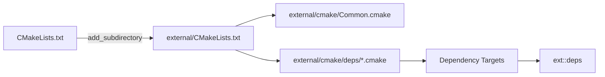

# External Dependencies

Third-party dependency configuration and vendored libraries.

## 1. Purpose and Responsibility
The `external` module defines how third-party libraries are fetched, configured, and linked.
It does not contain application logic; it provides CMake integration for external dependencies.
Within the overall architecture, this folder is the single source of truth for dependency setup.

## 2. Conceptual Overview
- **Concepts/Patterns**: Centralized dependency management via CMake `FetchContent` and per-dependency configuration files.
- **Design decision: split by dependency**: Each library has its own CMake fragment in `external/cmake/deps` for isolation and reviewability.
- **Design decision: interface target**: `ext::deps` aggregates common dependencies for consistent linking across targets.

## 3. Directory and File Structure
```
external/
├── CMakeLists.txt        # Entry point for external dependency configuration
├── cmake/
│   ├── Common.cmake       # Shared FetchContent options and dependency switches
│   └── deps/              # Per-dependency CMake fragments
│       ├── assimp.cmake
│       ├── eigen.cmake
│       ├── glad.cmake
│       ├── glfw.cmake
│       ├── glm.cmake
│       ├── googletest.cmake
│       ├── imgui.cmake
│       ├── libigl.cmake
│       ├── nlohmann_json.cmake
│       └── spdlog.cmake
└── glad/                  # Vendored GLAD source used by the build
```

## 4. Main Components (Modules)
**external/CMakeLists.txt**
- **Responsibility**: Loads shared configuration and per-dependency CMake files.
- **Interfaces**: Defines the `ext::deps` interface target.
- **Relation**: Included by the top-level build via `add_subdirectory(external)` in `CMakeLists.txt`.

**external/cmake/Common.cmake**
- **Responsibility**: Defines FetchContent options and dependency switches.
- **Interfaces**: CMake options such as `FETCH_USE_SHALLOW`, `FETCH_ALLOW_UPDATES`, `MEDUSA_FETCH_PARALLEL`, `EXT_IMGUI_WITH_DEMO`, `EXT_SPDLOG_USE_STD_FORMAT`, `EXT_SPDLOG_NO_EXCEPTIONS`.
- **Relation**: Included by `external/CMakeLists.txt` before per-dependency configuration.

**external/cmake/deps/*.cmake**
- **Responsibility**: Per-dependency configuration for GLFW, GLM, spdlog, GLAD, ImGui, Assimp, nlohmann_json, Eigen, libigl, and GoogleTest.
- **Relation**: Each file configures a single dependency and its CMake target(s).

**external/glad/**
- **Responsibility**: Vendored GLAD source for OpenGL loader integration.
- **Relation**: Used by `external/cmake/deps/glad.cmake` to provide the `glad_lib` target.

## 5. Interfaces and Data Flow
**Inputs**
- CMake configuration and cache options at configure time.

**Outputs**
- Dependency targets, including the aggregate `ext::deps` interface library.

**Communication with Other Modules**
- The top-level build adds this module via `add_subdirectory(external)` in `CMakeLists.txt`.
- Application and library targets link against `ext::deps` as a convenience target.



## 6. Libraries / Dependencies
- **GLFW**: Windowing and input.
- **GLM**: Math library for vectors/matrices.
- **spdlog**: Logging backend.
- **GLAD**: OpenGL loader (vendored source).
- **Dear ImGui**: Immediate-mode GUI.
- **Assimp**: Mesh import.
- **nlohmann_json**: JSON parsing.
- **Eigen**: Linear algebra (used by geometry/slicing components).
- **libigl**: Geometry processing utilities.
- **GoogleTest** (optional): Unit test framework when `MEDUSA_BUILD_TESTS` is enabled.

## 7. Build Integration
- `external` is added by the root `CMakeLists.txt` via `add_subdirectory(external)`.
- Common dependency targets are aggregated in the interface library `ext::deps`.
- FetchContent options are configured in `external/cmake/Common.cmake` for reproducibility and stability.

## 8. Usage (for Other Developers)
Minimal usage pattern (CMake):

```cmake
add_executable(my_target ...)
target_link_libraries(my_target PRIVATE ext::deps)
```

## 9. Extension and Maintenance
- **Extension points**: Add new dependency CMake fragments under `external/cmake/deps/` and link them into `external/CMakeLists.txt`.
- **Invariants**:
  - Keep `ext::deps` consistent with the core dependencies expected by the application.
  - Preserve FetchContent defaults to maintain reproducible builds.
- **Limitations**: Dependency versions are defined in the per-dependency CMake fragments and are not surfaced here.

## 10. Glossary
- **FetchContent**: CMake module for downloading and integrating external projects during configure.
- **Interface library**: CMake target that carries include and link dependencies without producing output.

