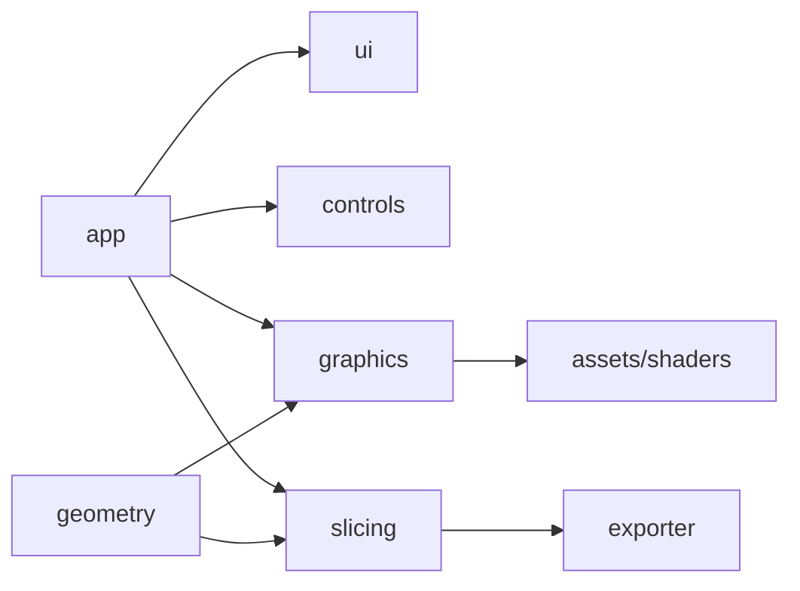

# Source Code

Top-level source tree for the Medusa application and libraries.

## 1. Purpose and Responsibility
The `src` module contains all production source code for Medusa.
It defines libraries and the optional GUI application, while submodules provide domain-specific functionality.
Within the overall architecture, this directory is the integration point for core logic, rendering, slicing, and UI.

## 2. Conceptual Overview
- **Concepts/Patterns**: Modular architecture with dedicated subdirectories per concern.
- **Design decision: submodule separation**: Each subsystem (core, graphics, slicing, etc.) is isolated to keep responsibilities explicit.
- **Design decision: optional app**: The GUI application is built only when `MEDUSA_BUILD_APP` is enabled.

## 3. Directory and File Structure
```
src/
├── CMakeLists.txt
├── app/        # GUI application (optional build)
├── controls/   # Input and interaction layer
├── core/       # Core utilities (logging, base types)
├── exporter/   # Toolpath export and serialization
├── geometry/   # Geometry data structures and utilities
├── graphics/   # Rendering and GPU abstractions
├── slicing/    # Slicing algorithms and pipeline
└── ui/         # Dear ImGui UI layer
```

## 4. Main Components (Modules)
**app/**
- **Responsibility**: Application entry point, window lifecycle, and orchestration.
- **Relation**: Built only if `MEDUSA_BUILD_APP` is enabled.

**controls/**
- **Responsibility**: Input handling and camera/user interaction.
- **Relation**: Used by `app` and UI components.

**core/**
- **Responsibility**: Core utilities such as logging and shared helpers.
- **Relation**: Linked by most subsystems.

**exporter/**
- **Responsibility**: Toolpath export, validation, and JSON serialization.
- **Relation**: Consumes slicing output and produces export artifacts.

**geometry/**
- **Responsibility**: Mesh data structures and geometry utilities.
- **Relation**: Consumed by slicing and rendering pipelines.

**graphics/**
- **Responsibility**: OpenGL rendering, shader management, and GPU resources.
- **Relation**: Used by the app for scene and toolpath rendering.

**slicing/**
- **Responsibility**: Slicing algorithms and toolpath generation.
- **Relation**: Produces toolpaths for export and visualization.

**ui/**
- **Responsibility**: Dear ImGui integration and UI rendering.
- **Relation**: Provides UI components for the application.

## 5. Interfaces and Data Flow
**Inputs**
- Meshes and user input from the application layer.

**Outputs**
- Rendered frames and toolpath export data.

**Communication with Other Modules**
- `geometry` provides mesh data to `slicing` and `graphics`.
- `slicing` produces toolpaths consumed by `exporter` and `graphics`.
- `ui` and `controls` drive interactions in `app`.



## 6. Libraries / Dependencies
- Dependencies are defined in `external/`; `src` modules link via `ext::deps` as needed.

## 7. Build Integration
- Subdirectories are added by `src/CMakeLists.txt`.
- `app/` is included only when `MEDUSA_BUILD_APP` is enabled.

## 8. Usage (for Other Developers)
Module-specific usage is documented in each submodule README.

## 9. Extension and Maintenance
- **Extension points**: Add new submodules under `src/` and include them in `src/CMakeLists.txt`.
- **Invariants**:
  - Keep module boundaries explicit (no cross-cutting utility code in feature modules).
  - Update this README when adding or renaming submodules.
- **Limitations**: This overview defers detailed API documentation to submodule READMEs.

## 10. Glossary
- **Submodule**: A top-level directory under `src/` with a dedicated responsibility.
- **Toolpath**: Ordered waypoint list generated by the slicer.

