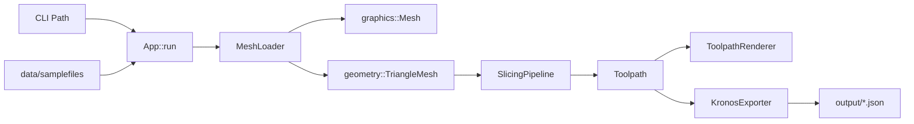

# App

GUI application entry point and runtime orchestrator.

## 1. Purpose and Responsibility
The `src/app` module hosts the executable entry point and the `App` controller that wires together windowing, rendering, UI, slicing, and export.
It does not implement low-level rendering or slicing logic; it coordinates those subsystems at runtime.
Within the overall architecture, this directory is the top of the runtime call graph for the interactive application.

## 2. Conceptual Overview
- **Concepts/Patterns**: Central application controller managing subsystem lifecycles.
- **Design decision: explicit init order**: Renderers, UI, and GL context are initialized in a defined sequence to keep dependencies stable.
- **Design decision: export after slicing**: Toolpath export is triggered immediately after a successful slicing run to keep artifacts in sync.

## 3. Directory and File Structure
```
src/app/
├── CMakeLists.txt
├── main.cpp   # Process entry point
├── app.h      # App class definition
└── app.cpp    # App implementation
```

## 4. Main Components (Classes)
**main.cpp**
- **Responsibility**: Initializes logging, constructs `App`, and forwards CLI arguments to `App::run()`.
- **Relation**: The only process entry point when `MEDUSA_BUILD_APP` is enabled.

**App (app.h / app.cpp)**
- **Responsibility**: Owns the window, GL context, renderers, UI, and slicing/export orchestration.
- **Key methods**:
  - `run(argc, argv)`: Entry point for startup, main loop, and shutdown.
  - `initGL() / shutdownGL()`: GLFW/GLAD setup and teardown.
  - `loop()`: Main frame loop (input, render, UI, swap buffers).
  - `loadMesh(path)`: Loads a mesh and prepares it for rendering/slicing.
  - `runSlicing()`: Executes the selected slicing algorithm and updates render overlays.
  - `exportToolpath()`: Exports slicing results as Kronos JSON into `output/`.
- **Relations**: Uses renderers from `graphics`, slicers from `slicing`, and exporter from `exporter`.

## 5. Interfaces and Data Flow
**Inputs**
- Mesh files selected from `data/samplefiles` or passed via CLI.
- UI state changes (render toggles, slicer parameters).

**Outputs**
- Rendered frames via OpenGL.
- Toolpath JSON exports via `KronosExporter`.

**Communication with Other Modules**
- Mesh import via `graphics::MeshLoader` (Assimp-backed).
- Algorithmic mesh conversion via `geometry` for slicing.
- Slicing via `slicing::SlicingPipeline` and specific slicers.
- Toolpath export via `medusa::kronos::KronosExporter`.



## 6. Libraries / Dependencies
- **GLFW/GLAD/OpenGL**: Window creation and rendering context.
- **Dear ImGui**: UI rendering and interaction.
- **Assimp**: Mesh import via `MeshLoader`.

## 7. Build Integration
- Built only when `MEDUSA_BUILD_APP` is enabled in the root `CMakeLists.txt`.
- `src/app/CMakeLists.txt` defines the executable target and links core libraries.

## 8. Usage (for Other Developers)
- Entry via `main.cpp` only; no direct library API usage is intended here.
- CLI supports a single optional mesh path argument (loaded at startup).

## 9. Extension and Maintenance
- **Extension points**: Add new UI panels in `App::renderImGui()` and new render passes in `renderScene3d()`.
- **Invariants**:
  - The GL context must exist before renderer initialization.
  - Slicing requires a valid `geometry::TriangleMesh`.
- **Limitations**: UI logic and orchestration are centralized in `App`, so large features may require refactoring into new components.

## 10. Glossary
- **App**: The runtime controller for the Medusa GUI application.
- **Slicing pipeline**: Process that converts geometry into a toolpath.

