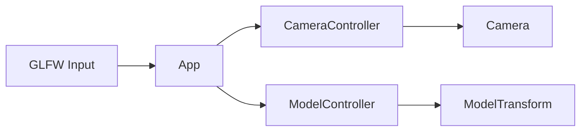

# Controls

Input controllers for camera and model interaction.

## 1. Purpose and Responsibility
The `src/controls` module converts user input (mouse and scroll) into camera and model transformations.
It does not render or own the scene; it updates state objects used by renderers.
Within the overall architecture, it sits between the window/input layer and the rendering pipeline.

## 2. Conceptual Overview
- **Concepts/Patterns**: Controller classes wrap state objects (`Camera`, `ModelTransform`) to keep input logic separate from math/state.
- **Design decision: UI capture guard**: Controllers ignore input when ImGui is capturing the mouse to avoid conflicting interactions.
- **Design decision: left/right mouse split**: Left-drag rotates the model; right-drag rotates the camera; scroll adjusts camera distance.

## 3. Directory and File Structure
```
src/controls/
├── CMakeLists.txt
├── camera_controller.h/.cpp
└── model_controller.h/.cpp
```

## 4. Main Components (Classes)
**CameraController** (`camera_controller.h/.cpp`)
- **Responsibility**: Updates the `Camera` based on right-mouse dragging and scroll wheel input.
- **Key methods**:
  - `updateFromMouseDrag(window, isUiCapturingMouse)`
  - `updateFromScroll(yOffset)`
  - `reset()`
- **Relation**: Used by `App` during event polling and in the scroll callback.

**ModelController** (`model_controller.h/.cpp`)
- **Responsibility**: Updates `ModelTransform` yaw/pitch from left-mouse dragging.
- **Key methods**:
  - `updateFromMouseDrag(window, isUiCapturingMouse)`
  - `getTransform()`
- **Relation**: Used by `App` per frame to update the model transform.

## 5. Interfaces and Data Flow
**Inputs**
- GLFW mouse button state, cursor position, and scroll deltas.
- UI capture state from ImGui.

**Outputs**
- Updated `Camera` state (azimuth, elevation, distance).
- Updated `ModelTransform` state (manual yaw/pitch).

**Communication with Other Modules**
- `CameraController` wraps `core::Camera` and is consumed by `App`.
- `ModelController` wraps `graphics::ModelTransform` and is consumed by `App`.



## 6. Libraries / Dependencies
- **GLFW**: Input polling and window context.
- **GLM**: Math types used by `Camera` and `ModelTransform`.

## 7. Build Integration
- Built as `medusa::controls` in `src/controls/CMakeLists.txt`.
- Links against `medusa::core`, `medusa::graphics`, and `ext::glfw`.

## 8. Usage (for Other Developers)
Minimal usage pattern (pseudo-code):

```cpp
CameraController camCtrl;
ModelController modelCtrl;

camCtrl.updateFromMouseDrag(window, uiCapturingMouse);
camCtrl.updateFromScroll(scrollY);

modelCtrl.updateFromMouseDrag(window, uiCapturingMouse);
const auto& transform = modelCtrl.getTransform();
```

## 9. Extension and Maintenance
- **Extension points**: Add new input gestures or controller parameters in the respective controller classes.
- **Invariants**:
  - Input handlers must respect UI capture to avoid conflicts.
  - Model rotation is disabled when auto-rotate is enabled.
- **Limitations**: Input mappings are fixed; no user-configurable bindings yet.

## 10. Glossary
- **Controller**: Class that maps raw input to state updates.
- **UI capture**: ImGui state indicating the UI is consuming mouse input.

