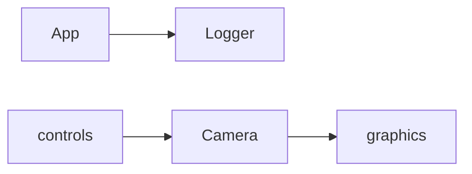

# Core

Core utilities shared across the project.

## 1. Purpose and Responsibility
The `src/core` module provides foundational utilities used by most subsystems.
It does not implement domain-specific features; it supplies logging and camera math primitives.
Within the overall architecture, it is the base dependency for rendering, UI, and controls.

## 2. Conceptual Overview
- **Concepts/Patterns**: Small, reusable primitives with minimal dependencies.
- **Design decision: global logger**: A single asynchronous logger instance is shared via static accessors and macros.
- **Design decision: orbit camera**: A compact camera model provides view/projection matrices for the scene.

## 3. Directory and File Structure
```
src/core/
├── CMakeLists.txt
├── camera.h/.cpp
└── logger.h/.cpp
```

## 4. Main Components (Classes)
**Logger** (`logger.h/.cpp`)
- **Responsibility**: Initializes and manages a global asynchronous `spdlog` logger.
- **Key methods**:
  - `init(logsDirectory, console_level, fileLevel)`
  - `shutdown()`
  - `get()`
- **Relations**: Accessed through macros (`MEDUSA_INFO`, `MEDUSA_WARN`, etc.) across the codebase.

**Camera** (`camera.h/.cpp`)
- **Responsibility**: Minimal orbit camera that produces view/projection matrices and clamps parameters.
- **Key methods**:
  - `proj(aspect)`
  - `view()`
  - `setFovDegrees() / setDistance() / setElevationDegrees() / setAzimuthDegrees()`
- **Relations**: Driven by `CameraController` in `src/controls` and consumed by renderers in `src/graphics`.

## 5. Interfaces and Data Flow
**Inputs**
- Logger configuration (log directory and levels).
- Camera parameters (FOV, distance, azimuth, elevation, clip planes).

**Outputs**
- Log messages to console and rotating file sinks.
- View and projection matrices for rendering.

**Communication with Other Modules**
- Logging macros are used throughout the application (e.g., `App`, renderers, slicers).
- `Camera` is updated by the controls layer and read by renderers for matrix computation.



## 6. Libraries / Dependencies
- **spdlog**: Asynchronous logging backend with rotating file sink.
- **GLM**: Math library for matrices and trigonometry.

## 7. Build Integration
- Built as `medusa::core` in `src/core/CMakeLists.txt`.
- Links against `ext::spdlog` and `ext::glm`.
- `SPDLOG_ACTIVE_LEVEL` is set via CMake depending on build type.

## 8. Usage (for Other Developers)
Minimal logging usage:

```cpp
Logger::init("logs");
MEDUSA_INFO("Startup complete");
Logger::shutdown();
```

Minimal camera usage:

```cpp
Camera cam;
cam.setDistance(5.0f);
glm::mat4 view = cam.view();
```

## 9. Extension and Maintenance
- **Extension points**: Add new core utilities that are shared across modules.
- **Invariants**:
  - Logger must be initialized before use if logs are required.
  - Camera setters clamp to safe bounds to avoid invalid matrices.
- **Limitations**: Only an orbit camera is provided; no FPS/free-fly camera yet.

## 10. Glossary
- **Orbit camera**: Camera that moves on a sphere around a target point.
- **Rotating sink**: Log sink that rotates files by size and count.

