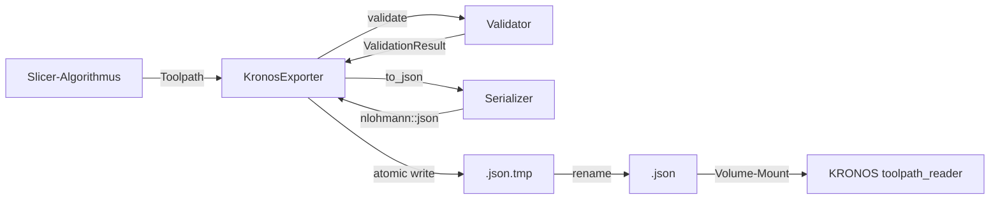

# Kronos-Exporter

Standalone-Exportbibliothek für die Übertragung von 6-DOF-Toolpaths aus MEDUSA an den ROS 2-basierten Robotersteuerungs-Stack KRONOS (UR3e).

## 1. Zweck und Verantwortung

### Was diese Bibliothek tut

Der Kronos-Exporter ist die **einzige Schnittstelle** zwischen der MEDUSA-Toolpath-Generierung (C++, Offline-Slicing) und dem KRONOS-Roboter-Stack (ROS 2, MoveIt, Python). Die Bibliothek:

- Serialisiert vollständige 6-DOF-Toolpaths (Position + Quaternion-Orientierung) ins JSON-Format
- Validiert Toolpaths auf Konsistenz, Vollständigkeit und strukturelle Korrektheit
- Berechnet Integritätsprüfsummen (FNV-1a-64) über Waypoint-Listen
- Schreibt Export-Dateien **atomar** (via `.tmp`-Rename) in ein gemeinsames Volume-Verzeichnis
- Versioniert das JSON-Schema (SemVer), sodass KRONOS inkompatible Änderungen erkennen kann

### Was diese Bibliothek bewusst NICHT tut

- **Keine Roboterkommunikation:** Der Exporter sendet keine Nachrichten an ROS 2, öffnet keine Sockets, hat keinen Rückkanal. KRONOS liest Dateien aus dem gemeinsamen Verzeichnis (`/shared/kronos_jobs/`).
- **Keine Kinematik-Prüfung:** Die Bibliothek enthält keine UR3e-Vorwärts- oder Inverskinematik. Erreichbarkeitsprüfungen sind über ein `IReachabilityCheck`-Interface abstrahiert; die Standardimplementierung akzeptiert jeden Waypoint.
- **Keine Toolpath-Generierung:** Slicing-Algorithmen (PlanarSlicer, Crystal, ...) sind in separaten Modulen. Der Exporter konsumiert deren Ergebnisse.
- **Keine Datei-Rotation:** Alte Export-Dateien werden nicht automatisch gelöscht; das ist KRONOS-seitig zu regeln.

### Stellung in der Gesamtarchitektur

```
┌─────────────────────────────────────────────────────────────────┐
│  MEDUSA (C++, Offline-Toolpath-Generierung)                     │
│  ┌─────────────────┐          ┌──────────────────────────┐      │
│  │  Slicer-Module  │  ───→    │  medusa::export   │      │
│  │  (Crystal,    │          │  (diese Library)         │      │
│  │   PlanarSlicer) │          └──────────┬───────────────┘      │
│  └─────────────────┘                     │                       │
└──────────────────────────────────────────┼───────────────────────┘
                                           │ JSON-Datei
                                           │ (Volume-Mount)
                        ┌──────────────────▼────────────────────┐
                        │  /shared/kronos_jobs/                 │
                        │  toolpath_<timestamp>_<algo>.json     │
                        └──────────────────┬────────────────────┘
                                           │
┌──────────────────────────────────────────┼───────────────────────┐
│  KRONOS (ROS 2, Python, Robotersteuerung)│                       │
│                    ┌───────────────────▼─────────────────┐       │
│                    │  toolpath_reader.py                 │       │
│                    │  - liest JSON                        │       │
│                    │  - konvertiert zu MoveIt-Trajektorien│       │
│                    │  - steuert UR3e                      │       │
│                    └─────────────────────────────────────┘       │
└─────────────────────────────────────────────────────────────────┘
```

Die Bibliothek ist **vollständig eigenständig** (keine Abhängigkeit von MEDUSA-internen Modulen außer Logging) und kann als Subprojekt oder standalone kompiliert werden.

---

## 2. Konzeptioneller Überblick

### Design-Patterns

| Pattern              | Anwendung                                                                                                     |
|----------------------|---------------------------------------------------------------------------------------------------------------|
| **Strategy**         | `IReachabilityCheck` erlaubt pluggable Kinematik-Validierung. Default: `DefaultReachabilityCheck` (leer).    |
| **Result Type**      | Eigene `Result<T, E>`-Klasse statt Exceptions für Export-Fehler (expliziter Fehlerfluss).                   |
| **Value Object**     | `Waypoint`, `JobMetadata`, `Toolpath` sind Plain Old Data (POD), keine Logik.                               |
| **Facade**           | `KronosExporter` verbirgt die mehrstufige Pipeline (Validierung → Serialisierung → atomares Schreiben).      |

### Zentrale Design-Entscheidungen

#### Warum Quaternionen statt Rotationsmatrizen?

Quaternionen sind der **native Orientierungstyp** in ROS 2 (`geometry_msgs/msg/Quaternion`) und MoveIt. Alternativen:

- **Rotationsmatrizen (3×3):** Benötigen 9 Zahlen statt 4, höheres Serialisierungsvolumen, zusätzliche Konvertierung in ROS 2.
- **Achse-Winkel:** Numerisch instabil nahe 0° und 180° (Gimbal-Lock-Ähnliches Problem).
- **Euler-Winkel:** Mehrdeutig (12 Konventionen), Gimbal-Lock bei ±90°.

Quaternionen eliminieren diese Probleme, sind kompakt, und ROS 2 / MoveIt verarbeiten sie direkt ohne Zwischenschritt.

#### Warum ein eigener Result-Typ statt `std::expected`?

`std::expected` ist Teil von C++23, die Bibliothek setzt jedoch nur C++20 voraus, um breite Kompatibilität zu gewährleisten (libc++ auf macOS, libstdc++ auf Linux). Ein eigener `Result<T, E>`-Typ auf Basis von `std::variant` erfüllt denselben Zweck ohne zusätzliche Abhängigkeiten.

#### Warum FNV-1a-64 statt SHA-256 oder CRC32?

Die `waypoints_hash`-Prüfsumme dient der **Integritätsprüfung**, nicht der kryptografischen Sicherheit. FNV-1a-64:

- Erfordert keine externe Crypto-Library (OpenSSL, Botan).
- Ist deterministisch und kollisionsarm für kleine bis mittlere Datenmengen (typisch 100–10.000 Waypoints).
- Berechnet sich in < 1 ms auch für große Toolpaths.

CRC32 wäre zu kurz (32 Bit → höhere Kollisionsrate bei vielen Exporten), SHA-256 überdimensioniert (Crypto-Lib notwendig, kein Mehrwert bei fehlender Angriffsgefahr).

#### Warum atomares Schreiben via `.tmp`-Rename?

KRONOS könnte die JSON-Datei lesen, während MEDUSA sie noch schreibt, was zu korrupten Daten führt. Das Schreiben erfolgt daher zweistufig:

1. Datei wird als `toolpath_<timestamp>_<algo>.json.tmp` vollständig geschrieben.
2. Atomic Rename zu `toolpath_<timestamp>_<algo>.json`.

Auf POSIX-Systemen (Linux, macOS) ist `rename()` **garantiert atomar** (POSIX.1-2008 §3.338). KRONOS ignoriert alle `.tmp`-Dateien.

---

## 3. Verzeichnis- und Dateistruktur

```
src/exporter/
├── CMakeLists.txt                # Build-Konfiguration (medusa::export Target)
├── README.md                     # Diese Dokumentation
│
├── version.h                     # Schema-Versionskonstante (SemVer)
├── result.h                      # Result<T, E>-Typ (std::variant-basiert)
├── motion_type.h                 # enum class MotionType {Travel, Print}
├── waypoint.h                    # struct Waypoint (6-DOF Pose + Prozessparameter)
├── job_metadata.h                # struct JobMetadata + enum SlicerAlgorithm
├── toolpath.h                    # struct Toolpath (Metadata + Waypoints)
│
├── serializer.h / .cpp           # JSON-Serialisierung (nlohmann/json), Hash-Berechnung
├── validator.h / .cpp            # Toolpath-Validierung (Finite-Checks, Quaternion-Norm, Layer-IDs)
├── exporter.h / .cpp             # KronosExporter (Pipeline-Facade)
│
├── export_demo.cpp               # Standalone-Demo (kompilierbares Minimal-Beispiel)
├── serializer_tests.cpp           # Unit-Tests Serialisierung
├── validator_tests.cpp            # Unit-Tests Validierung
├── exporter_tests.cpp             # Unit-Tests End-to-End-Export
│
└── schema/
    └── toolpath.schema.json      # Formales JSON-Schema (JSON Schema Draft 2020-12)
```

| Datei                        | Zeilen | Beschreibung                                                                 |
|------------------------------|--------|------------------------------------------------------------------------------|
| `version.h`                  | ~10    | Definiert `k_schema_version` (inline constexpr, in JSON eingebettet)        |
| `result.h`                   | ~45    | Template-Klasse `Result<T, E>` mit `.is_ok()`, `.value()`, `.error()`       |
| `motion_type.h`              | ~25    | Enum `MotionType` + String-Konvertierung                                    |
| `waypoint.h`                 | ~35    | POD-Struct: x/y/z, qw/qx/qy/qz, feed_rate, extrusion, layer_id, segment_id  |
| `job_metadata.h`             | ~47    | POD-Struct: slicer_version, algorithm, created_at, waypoints_hash, ...      |
| `toolpath.h`                 | ~16    | Kombiniert `JobMetadata` + `vector<Waypoint>`                               |
| `serializer.cpp`             | ~180   | FNV-1a-64-Hash, to_json / from_json, Schema-Versionierung                   |
| `validator.cpp`              | ~90    | Validierung: Finite-Werte, Quaternion-Norm ≈ 1, monotone Layer-IDs          |
| `exporter.cpp`               | ~140   | Pipeline: Validierung → JSON → Atomic Write, Timestamp-Generierung          |
| **Summe (Production Code)**  | ~1400  | Header + Implementierung (ohne Tests, ohne Demo)                            |

---

## 4. Hauptkomponenten

### 4.1 `Waypoint` (waypoint.h)

**Verantwortung:** Repräsentation eines einzelnen 6-DOF-Wegpunkts mit Prozessparametern.

**Struktur:**
```cpp
struct Waypoint {
    // Position [mm]
    double x, y, z;
    
    // Orientierung (Unit Quaternion, ROS-Konvention: w, x, y, z)
    double qw, qx, qy, qz;
    
    // Prozessparameter
    double feed_rate;  // [mm/s]
    double extrusion;  // [mm³/s], 0 für Travel-Moves
    
    // Klassifikation
    MotionType    motion_type; // Travel | Print
    std::uint32_t layer_id;    // 0-basiert, monoton nicht-abnehmend
    std::uint32_t segment_id;  // Segment innerhalb eines Layers
    std::uint32_t branch_id;   // Branch-ID (Crystal: 0 = Basis, 1+ = Zweige)
};
```

**Anmerkungen:**
- Quaternion-Reihenfolge `(w, x, y, z)` entspricht `geometry_msgs/msg/Quaternion` in ROS 2.
- `branch_id` ist für Crystal-Workflows relevant (Branch-Tracking bei verzweigter Geometrie), wird von anderen Slicern auf 0 gesetzt.

### 4.2 `JobMetadata` (job_metadata.h)

**Verantwortung:** Speichert Metadaten eines Slicing-Jobs.

**Felder:**
```cpp
struct JobMetadata {
    std::string     slicer_version;   // SemVer der MEDUSA-Version, z.B. "0.0.1"
    SlicerAlgorithm algorithm;        // Enum: Planar | Base | Crystal
    std::string     units_position;   // Immer "mm"
    std::string     units_time;       // Immer "s"
    std::string     reference_frame;  // TF2-Frame-Name, z.B. "workpiece"
    std::string     created_at;       // ISO 8601 UTC, z.B. "2026-05-08T14:30:00Z"
    std::string     schema_version;   // Wird automatisch aus version.h gesetzt
    std::string     waypoints_hash;   // FNV-1a-64 über Waypoint-Array (16 Hex-Ziffern)
};
```

**Begründung für `SlicerAlgorithm`-Enum:**
KRONOS kann Toolpaths unterschiedlich verarbeiten (z.B. Crystal mit Branch-Switches, Planar ohne spezielle Logik). Das `algorithm`-Feld erlaubt KRONOS-seitige Dispatching-Logik.

### 4.3 `Serializer` (serializer.h / .cpp)

**Verantwortung:** Konvertierung zwischen `Toolpath` (C++) und `nlohmann::json`.

**API:**
```cpp
nlohmann::json to_json(const Toolpath& toolpath);  // Serialisiert, berechnet Hash
Toolpath from_json(const nlohmann::json& j);       // Deserialisiert, prüft Schema
```

**Interne Arbeitsweise:**
1. `to_json`: 
   - Serialisiert Waypoints in JSON-Array (ohne Hash-Feld).
   - Berechnet FNV-1a-64-Hash über `waypoints.dump()`.
   - Setzt `waypoints_hash` im Metadata-Objekt.
   - Fügt alle Felder zum finalen JSON zusammen.

2. `from_json`:
   - Prüft `schema_version` auf Major-Versions-Kompatibilität.
   - Deserialisiert alle Pflichtfelder, wirft `std::runtime_error` bei fehlenden Keys.

**Hash-Algorithmus (FNV-1a-64):**
```cpp
constexpr uint64_t k_fnv1a_offset = 14695981039346656037ULL;
constexpr uint64_t k_fnv1a_prime  = 1099511628211ULL;

uint64_t fnv1a_64(string_view data) {
    uint64_t hash = k_fnv1a_offset;
    for (unsigned char c : data) {
        hash ^= uint64_t(c);
        hash *= k_fnv1a_prime;
    }
    return hash;
}
```

Deterministisch, keine Crypto-Lib notwendig, ausreichend kollisionsarm für Integritätschecks.

### 4.4 `Validator` (validator.h / .cpp)

**Verantwortung:** Strukturelle Validierung eines `Toolpath` vor Export.

**API:**
```cpp
class Validator {
public:
    explicit Validator(
        std::shared_ptr<IReachabilityCheck> reach_check = 
            std::make_shared<DefaultReachabilityCheck>()
    );
    
    ValidationResult validate(const Toolpath& toolpath) const;
};

struct ValidationResult {
    std::vector<ValidationError> errors;
    bool is_valid() const;
};
```

**Prüfungen:**
- **Metadaten:** `slicer_version` und `reference_frame` nicht leer.
- **Waypoints nicht leer:** Mindestens 1 Waypoint erforderlich.
- **Finite Werte:** Position, Quaternion-Komponenten, `feed_rate`, `extrusion` müssen endlich sein (kein NaN, kein Inf).
- **Quaternion-Norm:** `||q||² ≈ 1.0` (Toleranz 1e-6).
- **Monotone Layer-IDs:** `layer_id[i] >= layer_id[i-1]` (mehrere Waypoints pro Layer erlaubt).
- **Erreichbarkeit (pluggable):** Falls ein `IReachabilityCheck` injiziert wurde, wird jeder Waypoint geprüft.

**Extension Point:**
```cpp
class IReachabilityCheck {
public:
    virtual ValidationResult check(const Waypoint& wp) const = 0;
};
```

Die Default-Implementierung akzeptiert jeden Waypoint. Eine UR3e-spezifische Implementierung (z.B. via MoveIt IK-Check) kann als separate Klasse nachgeliefert und via Konstruktor injiziert werden.

### 4.5 `KronosExporter` (exporter.h / .cpp)

**Verantwortung:** Facade für die vollständige Export-Pipeline.

**API:**
```cpp
class KronosExporter {
public:
    explicit KronosExporter(
        std::filesystem::path output_dir,
        std::shared_ptr<Validator> validator = std::make_shared<Validator>()
    );
    
    Result<std::filesystem::path> export_job(const Toolpath& toolpath);
};
```

**Pipeline (Reihenfolge):**
1. **Validierung:** `validator_->validate(toolpath)` → bei Fehlern `Result::err(...)`.
2. **Serialisierung:** `to_json(toolpath)` → berechnet Hash, setzt `schema_version`.
3. **Verzeichnis-Erstellung:** `std::filesystem::create_directories(output_dir_)`.
4. **Dateiname generieren:** `toolpath_<UTC-Timestamp>_<algorithm>.json`.
5. **Atomic Write:**
   - Schreibe nach `<name>.json.tmp`.
   - `std::filesystem::rename(tmp_path, final_path)` (atomar auf POSIX).
6. **Rückgabe:** `Result::ok(final_path)`.

**Dateiname-Format:**
```
toolpath_2026-05-08T14-30-00Z_crystal.json
         └── UTC-Timestamp ──┘ └─ Algo ─┘
```

Zeitstempel hat Sekundenauflösung. Bei gleicher Sekunde überschreibt ein neuer Export den vorherigen (akzeptiertes Verhalten, last-write-wins).

---

## 5. Schnittstellen und Datenfluss

### 5.1 Eingabe

Der Exporter konsumiert eine vollständig gefüllte `Toolpath`-Struktur:

```cpp
Toolpath tp;
tp.metadata.slicer_version  = "0.0.1";
tp.metadata.algorithm       = SlicerAlgorithm::Crystal;
tp.metadata.reference_frame = "workpiece";
tp.metadata.created_at      = "2026-05-08T14:30:00Z";

tp.waypoints.push_back(Waypoint{
    .x = 10.0, .y = 5.0, .z = 0.2,
    .qw = 1.0, .qx = 0.0, .qy = 0.0, .qz = 0.0,
    .feed_rate = 50.0, .extrusion = 2.5,
    .motion_type = MotionType::Print,
    .layer_id = 0, .segment_id = 1
});
// ... weitere Waypoints
```

### 5.2 Ausgabe

**Erfolgsfall:**
```cpp
Result<std::filesystem::path> result = exporter.export_job(tp);
if (result.is_ok()) {
    std::cout << "Exported: " << result.value() << "\n";
}
```

**Fehlerfall:**
```cpp
if (result.is_err()) {
    std::cerr << "Export failed: " << result.error() << "\n";
}
```

### 5.3 JSON-Schema (Auszug)

```json
{
  "schema_version": "1.0.0",
  "slicer_version": "0.0.1",
  "algorithm": "crystal",
  "units": {"position": "mm", "time": "s"},
  "reference_frame": "workpiece",
  "created_at": "2026-05-08T14:30:00Z",
  "waypoints_hash": "a1b2c3d4e5f60718",
  "waypoints": [
    {
      "x": 10.0, "y": 5.0, "z": 0.2,
      "qw": 1.0, "qx": 0.0, "qy": 0.0, "qz": 0.0,
      "feed_rate": 50.0, "extrusion": 2.5,
      "motion_type": "print",
      "layer_id": 0, "segment_id": 1, "branch_id": 0
    }
  ]
}
```

Das vollständige JSON-Schema liegt in `schema/toolpath.schema.json` (JSON Schema Draft 2020-12).

### 5.4 Datenfluss-Diagramm



---

## 6. Verwendete Libraries und Abhängigkeiten

| Bibliothek          | Version   | Zweck                                                                                      | Lizenz    |
|---------------------|-----------|--------------------------------------------------------------------------------------------|-----------|
| **nlohmann/json**   | 3.11.3    | JSON-Serialisierung/-Deserialisierung. Header-only, keine Laufzeit-Abhängigkeit.          | MIT       |
| **medusa::core**    | (intern)  | Logging-Makros (`MEDUSA_INFO`, `MEDUSA_ERROR`, ...). Nur zur Kompilierzeit verlinkt.      | (intern)  |
| **std::filesystem** | C++20     | Pfad-Manipulation, Verzeichnis-Erstellung, atomares Rename. Teil der Standardbibliothek.  | (C++ Std) |
| **std::variant**    | C++17     | Basis für `Result<T, E>`-Implementierung (Alternative zu `std::expected` aus C++23).      | (C++ Std) |

### Warum nlohmann/json?

**Alternativen:**
- **RapidJSON:** Schneller, aber komplexere API, erfordert Speicherverwaltung.
- **Boost.JSON:** Zusätzliche Boost-Abhängigkeit (500+ MB Header-Library).
- **simdjson:** Nur Parsing (kein Serialisieren), overkill für kleine Toolpaths.

**Entscheidung:** nlohmann/json ist Header-only, integriert sich nahtlos in CMake, bietet intuitive API (`j["key"]`), und die Geschwindigkeit ist für Offline-Toolpath-Export (< 10.000 Waypoints) irrelevant (< 100 ms).

---

## 7. Build-Integration

### 7.1 CMake-Target

Die Bibliothek wird als **static library** `medusa_export` gebaut und als Alias `medusa::export` exportiert:

```cmake
add_library(medusa_export STATIC ${EXPORT_SOURCES})
add_library(medusa::export ALIAS medusa_export)

target_include_directories(medusa_export PUBLIC ${CMAKE_CURRENT_SOURCE_DIR})
target_link_libraries(medusa_export PUBLIC ext::json)
target_link_libraries(medusa_export PRIVATE medusa::core)
target_compile_features(medusa_export PUBLIC cxx_std_20)
```

**PUBLIC Dependencies:**
- `ext::json` (nlohmann/json) – Header müssen im Consumer sichtbar sein.

**PRIVATE Dependencies:**
- `medusa::core` – Logging-Makros (nur in `.cpp`-Dateien).

### 7.2 Verwendung im Haupt-Projekt

In `src/CMakeLists.txt`:
```cmake
add_subdirectory(exporter)
target_link_libraries(MedusaApp PRIVATE medusa::export)
```

Im C++-Code:
```cpp
#include "exporter.h"
using namespace medusa::kronos;

KronosExporter exporter{"/shared/kronos_jobs"};
auto result = exporter.export_job(toolpath);
```

### 7.3 Standalone-Build (optional)

Die Bibliothek kann auch außerhalb von MEDUSA gebaut werden:

```bash
cd src/exporter
cmake -B build -DEXPORT_BUILD_TESTS=ON -DEXPORT_BUILD_EXAMPLES=ON
cmake --build build
cd build && ctest --output-on-failure
```

Voraussetzung: nlohmann/json muss im System oder via CMake `FetchContent` verfügbar sein.

---

## 8. Verwendung (für Entwickler)

### 8.1 Minimal-Beispiel

```cpp
#include "exporter.h"
#include "toolpath.h"
#include "waypoint.h"
#include <numbers>

using namespace medusa::kronos;

int main() {
    // Toolpath aufbauen
    Toolpath tp;
    tp.metadata.slicer_version  = "0.0.1";
    tp.metadata.algorithm       = SlicerAlgorithm::Crystal;
    tp.metadata.reference_frame = "workpiece";
    tp.metadata.created_at      = "2026-05-11T10:00:00Z";
    
    // Waypoints hinzufügen
    Waypoint wp{};
    wp.x = 10.0; wp.y = 5.0; wp.z = 0.2;
    wp.qw = 1.0; wp.qx = wp.qy = wp.qz = 0.0;  // Identität
    wp.feed_rate = 50.0;
    wp.extrusion = 2.5;
    wp.motion_type = MotionType::Print;
    wp.layer_id = 0;
    wp.segment_id = 1;
    tp.waypoints.push_back(wp);
    
    // Export
    KronosExporter exporter{"/shared/kronos_jobs"};
    auto result = exporter.export_job(tp);
    
    if (result.is_ok()) {
        std::cout << "Exported: " << result.value() << "\n";
    } else {
        std::cerr << "Error: " << result.error() << "\n";
    }
}
```

### 8.2 Quaternion-Konvertierung (Beispiel)

Der Exporter erwartet **normalisierte Quaternionen**. Wenn der Slicer eine Normale `n` (z.B. Gradient eines Feldes) liefert, erfolgt die Konvertierung via:

```cpp
// Gegeben: Normale n (Approach Vector, zeigt vom Teil weg)
glm::vec3 n = glm::normalize(gradient_phi);

// Ziel: Quaternion q, das (0,0,1) auf n rotiert
glm::vec3 default_z(0, 0, 1);
glm::vec3 axis = glm::cross(default_z, n);
float axis_len = glm::length(axis);

if (axis_len < 1e-8f) {
    // n parallel zu (0,0,1) → Identität oder 180°-Rotation
    wp.qw = (glm::dot(default_z, n) > 0.0f) ? 1.0 : 0.0;
    wp.qx = wp.qy = 0.0;
    wp.qz = (glm::dot(default_z, n) > 0.0f) ? 0.0 : 1.0;
} else {
    axis /= axis_len;
    float angle = std::acos(glm::clamp(glm::dot(default_z, n), -1.0f, 1.0f));
    float half_angle = angle / 2.0f;
    wp.qw = std::cos(half_angle);
    wp.qx = axis.x * std::sin(half_angle);
    wp.qy = axis.y * std::sin(half_angle);
    wp.qz = axis.z * std::sin(half_angle);
}
```

Diese Logik ist im App-Code (`app.cpp:826-857`) bereits implementiert.

### 8.3 Fehlerbehandlung

```cpp
auto result = exporter.export_job(tp);

if (result.is_err()) {
    // Fehler-String enthält Details:
    // - Validierungsfehler: "waypoints[3].qw: Non-finite value."
    // - Serialisierungsfehler: "NaN detected in waypoint position."
    // - Dateisystem-Fehler: "Failed to create output directory: ..."
    MEDUSA_ERROR("Export failed: {}", result.error());
    return -1;
}

std::filesystem::path json_path = result.value();
MEDUSA_INFO("Export successful: {}", json_path.string());
```

---

## 9. Erweiterung und Wartung

### 9.1 Extension Points

#### Eigene Erreichbarkeitsprüfung

Implementierung von `IReachabilityCheck` für UR3e-spezifische Kinematik:

```cpp
class UR3eReachabilityCheck : public IReachabilityCheck {
public:
    UR3eReachabilityCheck(/* MoveIt-Kontext, Kinematik-Solver, ... */) { ... }
    
    ValidationResult check(const Waypoint& wp) const override {
        ValidationResult vr;
        // IK-Check via MoveIt oder analytische UR3e-Kinematik
        if (!is_reachable(wp.x, wp.y, wp.z, wp.qw, wp.qx, wp.qy, wp.qz)) {
            vr.add("position", "Waypoint outside UR3e workspace.");
        }
        return vr;
    }
};
```

Injektion:
```cpp
auto reach_check = std::make_shared<UR3eReachabilityCheck>(...);
auto validator   = std::make_shared<Validator>(reach_check);
KronosExporter exporter{"/shared/kronos_jobs", validator};
```

#### Neue Slicer-Algorithmen registrieren

1. `SlicerAlgorithm`-Enum in `job_metadata.h` erweitern:
   ```cpp
   enum class SlicerAlgorithm {
       Planar, Base, Crystal,
       NewAlgorithm  // ← neue Variante
   };
   ```

2. String-Mapping in `serializer.cpp` ergänzen:
   ```cpp
   case SlicerAlgorithm::NewAlgorithm: return "newalgorithm";
   ```

3. Filename-Tag in `exporter.cpp` ergänzen:
   ```cpp
   case SlicerAlgorithm::NewAlgorithm: return "newalgorithm";
   ```

### 9.2 Zu erhaltende Invarianten

#### 1. Quaternion-Norm

Jeder exportierte Waypoint **muss** ein normalisiertes Quaternion haben (`||q||² ≈ 1.0`, Toleranz 1e-6). Der Validator prüft dies automatisch. Slicer-Code sollte Normalisierung direkt nach Quaternion-Konstruktion durchführen.

#### 2. Monotone Layer-IDs

`layer_id` **muss** monoton nicht-abnehmend sein: `layer_id[i] >= layer_id[i-1]`. Mehrere Waypoints dürfen dieselbe Layer-ID tragen (z.B. Contour + Infill desselben Layers). Travel-Moves zwischen Layern tragen die Layer-ID des **Ziel-Layers**.

#### 3. Schema-Versionierung (SemVer)

- **Patch-Version** (1.0.X → 1.0.Y): Bugfixes, keine Schema-Änderungen.
- **Minor-Version** (1.X.0 → 1.Y.0): Neue optionale Felder (KRONOS ignoriert unbekannte Keys).
- **Major-Version** (X.0.0 → Y.0.0): Breaking Changes (Pflichtfelder entfernt/umbenannt, Struktur geändert). KRONOS **muss** Export ablehnen.

Änderung der Major-Version erfordert Anpassung in `version.h` und Abstimmung mit KRONOS-Team.

#### 4. Atomares Schreiben

**Niemals** direkt nach `<name>.json` schreiben. Immer zuerst `.json.tmp`, dann Rename. Verletzung dieser Regel kann zu korrupten Reads in KRONOS führen.

### 9.3 Bekannte Limitationen

| Limitation                          | Begründung / Workaround                                                                                     |
|-------------------------------------|-------------------------------------------------------------------------------------------------------------|
| Keine UR3e-Kinematik-Prüfung        | Würde MoveIt- oder UR-RTDE-Abhängigkeit erfordern. Erweiterbar via `IReachabilityCheck`.                   |
| Hash ist kein kryptografischer Schutz | FNV-1a ist nicht collision-resistant gegen Angriffe. Bei Bedarf SHA-256 als separates Feature implementieren. |
| Keine Datei-Rotation                | Alte Exports werden nicht automatisch gelöscht. KRONOS-seitig über Cronjob oder Retention-Policy regelbar. |
| Keine inkrementellen Exports        | Jeder Export ist vollständig (kein Append-Modus). Toolpaths mit > 100.000 Waypoints könnten > 50 MB werden. |
| Keine Kompression                   | JSON ist plain-text. Bei großen Toolpaths könnte gzip-Kompression sinnvoll sein (nicht implementiert).     |

---

## 10. Glossar

| Begriff                      | Bedeutung                                                                                                           |
|------------------------------|---------------------------------------------------------------------------------------------------------------------|
| **6-DOF**                    | Six Degrees of Freedom – 3 Translations- + 3 Rotationsfreiheitsgrade (Position + Orientierung).                    |
| **Quaternion**               | Kompakte Darstellung von 3D-Rotationen (4 Zahlen: w, x, y, z), frei von Gimbal-Lock.                               |
| **FNV-1a-64**                | Fowler-Noll-Vo Hash-Algorithmus (64 Bit), nicht-kryptografisch, deterministisch, kollisionsarm.                    |
| **Atomic Write**             | Dateischreiboperation, die entweder vollständig oder gar nicht sichtbar ist (via `.tmp`-Rename auf POSIX).         |
| **Approach Vector**          | Tool-Z-Achse zeigt in die Richtung, aus der das Werkzeug kommt (MoveIt-/ROS 2-Konvention).                         |
| **Travel Move**              | Repositionierungsbewegung ohne Materialauftrag (`extrusion = 0`).                                                  |
| **Print Move**               | Bewegung mit Materialauftrag (`extrusion > 0`).                                                                     |
| **Layer ID**                 | 0-basierter Index eines Layers, monoton nicht-abnehmend (mehrere Waypoints pro Layer möglich).                     |
| **Branch ID**                | Crystal-spezifisch: 0 = Basislayer, 1+ = verzweigte Iso-Layer.                                                   |
| **KRONOS**                   | ROS 2-basierter Robotersteuerungs-Stack für UR3e (Python, MoveIt, `toolpath_reader.py`).                           |
| **MEDUSA**                   | Offline-Slicing-Software (C++), generiert Toolpaths, exportiert via diese Library an KRONOS.                       |
| **Schema Version (SemVer)**  | Semantic Versioning (Major.Minor.Patch) des JSON-Schemas. Major-Inkrement = Breaking Change.                       |
| **Volume-Mount**             | Gemeinsames Dateisystem-Verzeichnis zwischen MEDUSA (Schreiber) und KRONOS (Leser), z.B. `/shared/kronos_jobs/`.   |

---

## Anhang: JSON-Schema-Referenz

Das vollständige JSON-Schema liegt in `schema/toolpath.schema.json`. Die wichtigsten Felder auf Oberebene:

| Feld              | Typ    | Pflicht | Beschreibung                                                      |
|-------------------|--------|---------|-------------------------------------------------------------------|
| `schema_version`  | string | ✓       | SemVer der Library, z.B. `"1.0.0"` (automatisch gesetzt)          |
| `slicer_version`  | string | ✓       | SemVer von MEDUSA, z.B. `"0.0.1"`                                 |
| `algorithm`       | string | ✓       | `planar` \| `base` \| `crystal`                                 |
| `units.position`  | string | ✓       | Immer `"mm"`                                                      |
| `units.time`      | string | ✓       | Immer `"s"`                                                       |
| `reference_frame` | string | ✓       | TF2-Frame-Name, z.B. `"workpiece"`                                |
| `created_at`      | string | ✓       | ISO 8601 UTC, z.B. `"2026-05-08T14:30:00Z"`                       |
| `waypoints_hash`  | string | ✓       | FNV-1a-64 über `waypoints`-JSON (16 Hex-Ziffern, automatisch)    |
| `waypoints`       | array  | ✓       | Geordnete Wegpunktliste (≥ 1 Element)                             |

---

## Lizenzhinweise

| Bibliothek          | Lizenz    | URL                                              |
|---------------------|-----------|--------------------------------------------------|
| nlohmann/json       | MIT       | https://github.com/nlohmann/json                 |
| GoogleTest (Tests)  | BSD-3     | https://github.com/google/googletest             |

Der Medusa-Code selbst unterliegt der Repository-Lizenz (siehe `LICENSE` im Projekt-Root).
