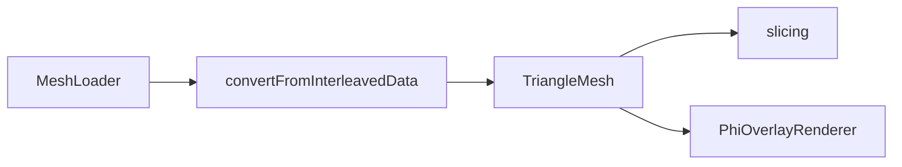

# Geometry

Geometry data structures and mesh conversion utilities.

## 1. Purpose and Responsibility
The `src/geometry` module defines algorithmic mesh representations and conversion utilities.
It does not load files or render meshes; it prepares data structures for slicing and analysis.
Within the overall architecture, it bridges raw mesh data and slicing algorithms.

## 2. Conceptual Overview
- **Concepts/Patterns**: Indexed triangle mesh with adjacency and derived properties.
- **Design decision: adjacency precomputation**: Face-to-face and vertex-to-face tables are built once to speed up algorithms.
- **Design decision: vertex welding**: Interleaved vertex data is welded by position to produce shared indices.

## 3. Directory and File Structure
```
src/geometry/
├── CMakeLists.txt
├── aabb.h
├── triangle_mesh.h
└── mesh_converter.h/.cpp
```

## 4. Main Components (Structures/Functions)
**AABB** (`aabb.h`)
- **Responsibility**: Axis-aligned bounding box for bounds, size, and radius queries.
- **Key methods**: `expand(point)`, `center()`, `size()`, `radius()`, `isValid()`.
- **Relation**: Stored on `TriangleMesh` as `bounds`.

**TriangleMesh** (`triangle_mesh.h`)
- **Responsibility**: Indexed mesh with normals, adjacency, and incidence lists.
- **Key fields**: `vertices`, `normals`, `faces`, `face_normals`, `face_to_face`, `vertex_to_faces`, `bounds`.
- **Relation**: Used by slicing algorithms and the Phi overlay renderer.

**Mesh conversion utilities** (`mesh_converter.h/.cpp`)
- **Responsibility**: Convert interleaved vertex buffers to `TriangleMesh` and compute derived data.
- **Key functions**:
  - `convertFromInterleavedData(...)`
  - `computeFaceNormals(mesh)`
  - `buildFaceAdjacency(mesh)`
  - `buildVertexToFaces(mesh)`
  - `computeBounds(mesh)`

## 5. Interfaces and Data Flow
**Inputs**
- Interleaved vertex data (pos.xyz + normal.xyz) from mesh loaders.

**Outputs**
- `TriangleMesh` with adjacency and bounds.

**Communication with Other Modules**
- `App` converts loader output via `geometry::convertFromInterleavedData`.
- `slicing` consumes `TriangleMesh` for toolpath generation.
- `graphics` consumes `TriangleMesh` for Phi overlay rendering.



## 6. Libraries / Dependencies
- **GLM**: Vector and matrix types.
- **medusa::core**: Logging utilities.

## 7. Build Integration
- Built as `medusa::geometry` in `src/geometry/CMakeLists.txt`.
- Links against `medusa::core`.

## 8. Usage (for Other Developers)
Minimal conversion usage:

```cpp
TriangleMesh mesh = geometry::convertFromInterleavedData(vertices);
if (mesh.isValid()) {
    // Use mesh for slicing or analysis
}
```

## 9. Extension and Maintenance
- **Extension points**: Add derived mesh data or utilities in `mesh_converter`.
- **Invariants**:
  - `face_to_face` uses `NO_ADJACENT_FACE` for boundaries.
  - `TriangleMesh` is treated as semi-immutable after construction.
- **Limitations**: Only triangle meshes are supported; no quad or polygon support.

## 10. Glossary
- **Adjacency**: Mapping from a face to its neighboring faces along shared edges.
- **Incidence list**: List of faces incident to a vertex.
- **Welding**: Merging duplicate vertices to create shared indices.

