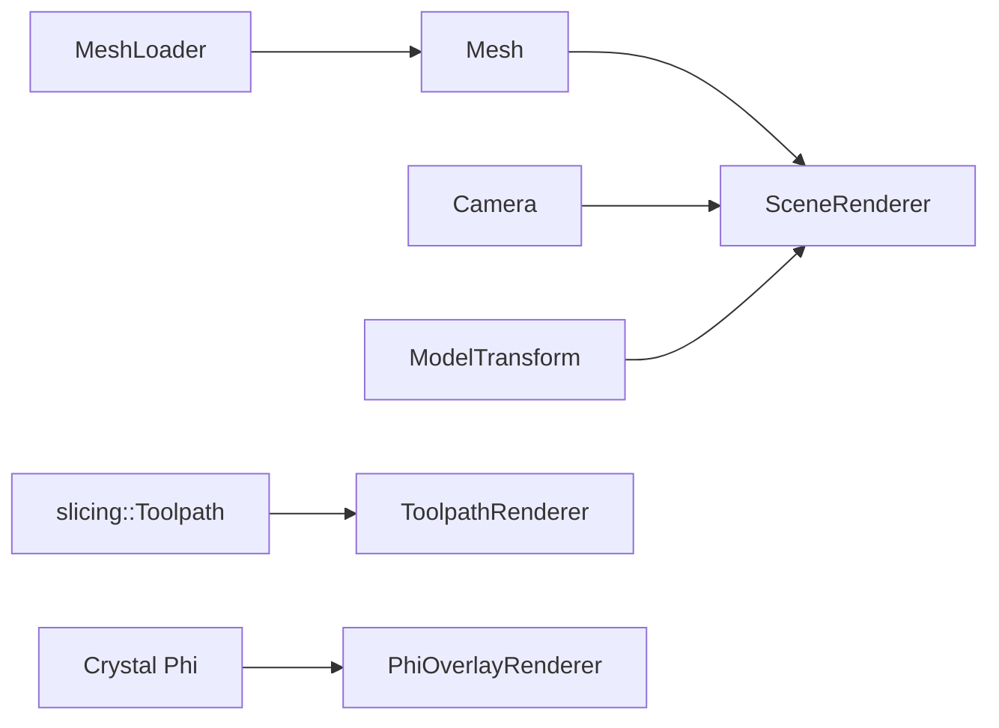

# Graphics

Rendering layer and GPU resource management.

## 1. Purpose and Responsibility
The `src/graphics` module provides OpenGL rendering, shader management, and GPU-side mesh resources.
It does not implement slicing or UI logic; it renders geometry, toolpaths, and overlays supplied by other modules.
Within the overall architecture, it is responsible for visual output and GPU resource lifecycles.

## 2. Conceptual Overview
- **Concepts/Patterns**: Renderer classes encapsulate shader setup and draw calls per visual element.
- **Design decision: fixed attribute locations**: Shaders and VAO layouts use fixed attribute slots to simplify binding.
- **Design decision: file-based shaders**: Shaders are loaded from `assets/shaders` via `ShaderProgram::createFromFiles()`.

## 3. Directory and File Structure
```
src/graphics/
├── CMakeLists.txt
├── axes_renderer.h/.cpp
├── grid_renderer.h/.cpp
├── mesh.h/.cpp
├── mesh_loader.h/.cpp
├── model_transform.h/.cpp
├── scene_renderer.h/.cpp
├── shader_program.h/.cpp
├── toolpath_renderer.h/.cpp
└── phi_overlay_renderer.h/.cpp
```

## 4. Main Components (Classes)
**ShaderProgram** (`shader_program.h/.cpp`)
- **Responsibility**: Compiles, links, and manages GLSL programs.
- **Key methods**: `create()`, `createFromFiles()`, `use()`, `loc()`.
- **Relation**: Used by all renderers.

**Mesh** (`mesh.h/.cpp`)
- **Responsibility**: GPU-resident mesh (VAO/VBO) for interleaved position/normal data.
- **Key methods**: `build()`, `draw()`, `clear()`.
- **Relation**: Filled from `MeshLoader` results; rendered by `SceneRenderer`.

**MeshLoader** (`mesh_loader.h/.cpp`)
- **Responsibility**: Loads STL/OBJ files via Assimp into interleaved vertex buffers.
- **Key methods**: `load(path, zUpToYUp)`, `loadFromCandidates(paths, zUpToYUp)`.
- **Relation**: Used by `App` for import; output is passed to `Mesh` and `geometry::TriangleMesh`.

**ModelTransform** (`model_transform.h/.cpp`)
- **Responsibility**: Computes model matrices from auto-rotation or manual yaw/pitch.
- **Relation**: Updated via `controls` and consumed by renderers.

**SceneRenderer** (`scene_renderer.h/.cpp`)
- **Responsibility**: Renders the main mesh with simple lighting and optional wireframe.
- **Relation**: Uses `assets/shaders/scene.vert/.frag`.

**AxesRenderer / GridRenderer** (`axes_renderer.*`, `grid_renderer.*`)
- **Responsibility**: Draws spatial reference helpers (axes and ground grid).
- **Relation**: Use `assets/shaders/axes.*` and `assets/shaders/grid.*`.

**ToolpathRenderer** (`toolpath_renderer.h/.cpp`)
- **Responsibility**: Visualizes toolpath segments, infill, travel, and orientation arrows.
- **Relation**: Uses `assets/shaders/toolpath.*` and `slicing::Toolpath` data.

**PhiOverlayRenderer** (`phi_overlay_renderer.h/.cpp`)
- **Responsibility**: Renders Crystal Phi scalar field as a heatmap overlay.
- **Relation**: Consumes `geometry::TriangleMesh` and `phi` values; uses `assets/shaders/phi_overlay.*`.

## 5. Interfaces and Data Flow
**Inputs**
- Mesh vertex buffers from `MeshLoader`.
- Toolpaths from `slicing`.
- Phi scalar field data from Crystal.
- Camera and model transforms.

**Outputs**
- OpenGL draw calls into the active framebuffer.

**Communication with Other Modules**
- `App` drives renderer initialization and per-frame rendering.
- `controls` updates camera and model transforms.
- `geometry` provides mesh structures for overlays.



## 6. Libraries / Dependencies
- **OpenGL/GLAD**: GPU API and loader.
- **GLFW**: Window context for rendering.
- **GLM**: Math types and transforms.
- **Assimp**: Mesh import backend.

## 7. Build Integration
- Built as `medusa::graphics` in `src/graphics/CMakeLists.txt`.
- Links against `medusa::core`, `medusa::geometry`, and external GL/Assimp deps.
- `MEDUSA_PROJECT_ROOT` is defined for shader file path resolution.

## 8. Usage (for Other Developers)
Minimal renderer setup (pseudo-code):

```cpp
SceneRenderer scene;
scene.initialize();
scene.render(window, camera, mesh, modelMatrix, false, 1.0f);
```

## 9. Extension and Maintenance
- **Extension points**: Add new renderer classes with dedicated shaders under `assets/shaders`.
- **Invariants**:
  - Attribute locations: `aPos` at 0, `aNormal`/`aColor` at 1.
  - Shaders must be loadable from `MEDUSA_PROJECT_ROOT` paths.
- **Limitations**: Renderer shading is intentionally simple; advanced materials are not supported.

## 10. Glossary
- **VAO/VBO**: OpenGL objects storing vertex layouts and buffers.
- **MVP**: Model-View-Projection matrix used for transforming vertices.
- **Overlay**: Secondary visualization drawn on top of the main mesh.

