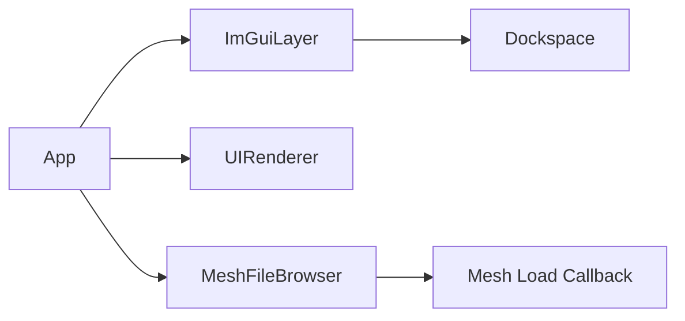

# UI

User interface layer built around Dear ImGui.

## 1. Purpose and Responsibility
The `src/ui` module provides the UI integration layer and UI-specific components.
It does not own application logic; it hosts UI rendering, layout persistence, and file browsing widgets.
Within the overall architecture, it is the primary interface between the user and the runtime system.

## 2. Conceptual Overview
- **Concepts/Patterns**: Immediate-mode UI (ImGui) with a dedicated layer class for lifecycle management.
- **Design decision: ImGui dockspace**: A full-screen dockspace provides flexible layouts and persistent UI state.
- **Design decision: file browser component**: Mesh selection is encapsulated in a reusable browser widget.

## 3. Directory and File Structure
```
src/ui/
├── CMakeLists.txt
├── im_gui_layer.h/.cpp
├── ui_renderer.h/.cpp
├── file_browser.h/.cpp
└── ui_style.h/.cpp
```

## 4. Main Components (Classes)
**ImGuiLayer** (`im_gui_layer.h/.cpp`)
- **Responsibility**: Creates and destroys the ImGui context, manages frame lifecycle, and hosts the dockspace window.
- **Key methods**:
  - `init(window)`
  - `beginFrame()` / `endFrameAndRender()`
  - `drawDockspaceHost()`
- **Relation**: Initialized and driven by `App` each frame.

**UIRenderer** (`ui_renderer.h/.cpp`)
- **Responsibility**: Renders simple 2D rectangles and buttons outside of ImGui.
- **Key methods**:
  - `init()` / `shutdown()`
  - `button(window, x, y, w, h, offColor, onColor, onState)`
- **Relation**: Owned by `App` for minimal custom overlays.

**MeshFileBrowser** (`file_browser.h/.cpp`)
- **Responsibility**: Scans directories for mesh files and renders a filterable ImGui table.
- **Key methods**:
  - `scanDirectory(baseDirectory)`
  - `draw(windowTitle, on_load_selected)`
- **Relation**: Used by `App` to select and load meshes.

**ui::apply* styles** (`ui_style.h/.cpp`)
- **Responsibility**: Defines Medusa-specific ImGui styling and light/dark themes.
- **Relation**: Applied after ImGui initialization and from the theme menu.

## 5. Interfaces and Data Flow
**Inputs**
- GLFW window handle and ImGui IO state.
- File system paths for mesh browsing.

**Outputs**
- ImGui draw data for UI rendering.
- File selection callbacks with absolute mesh paths.

**Communication with Other Modules**
- `App` calls `ImGuiLayer::beginFrame()` and `endFrameAndRender()` each frame.
- The file browser callback triggers mesh loading in `App`.
- UI styling is applied through `ui::applyMedusaStyle()` and theme selectors.



## 6. Libraries / Dependencies
- **Dear ImGui**: Immediate-mode GUI framework and backends.
- **GLFW**: Windowing and input for ImGui backends.
- **OpenGL**: Rendering backend for ImGui and custom UI primitives.

## 7. Build Integration
- Built as part of the `src` targets and linked into the application.

## 8. Usage (for Other Developers)
Minimal ImGui layer usage:

```cpp
ImGuiLayer imgui;
imgui.init(window);
imgui.beginFrame();
ImGuiLayer::drawDockspaceHost();
// ... draw windows ...
imgui.endFrameAndRender();
```

## 9. Extension and Maintenance
- **Extension points**: Add new UI panels in `App::renderImGui()` or extend `MeshFileBrowser` filters.
- **Invariants**:
  - ImGui must be initialized before UI rendering.
  - The ini file path remains stable (`data/settings/imgui.ini`).
- **Limitations**: UIRenderer is minimal and not a full alternative to ImGui.

## 10. Glossary
- **Dockspace**: ImGui feature that allows docking windows into a central host.
- **Immediate-mode UI**: UI paradigm where widgets are recreated each frame from code.

